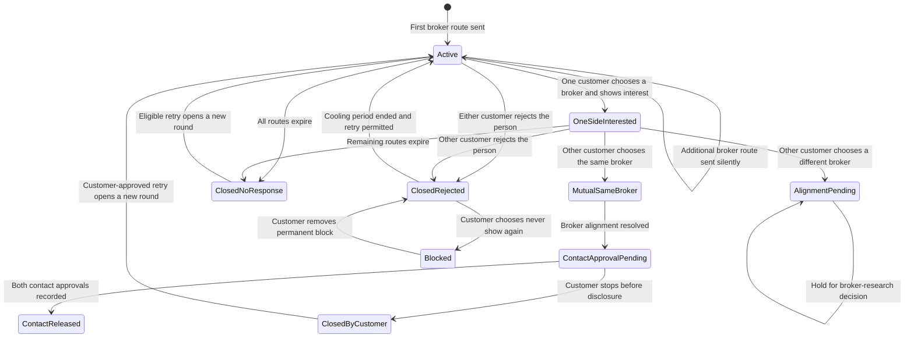

# BrokerDesk Phase 0C — Introduction State Contract

> **Superseded state model:** NAK-78 does not use a global customer-pair case
> with multiple private broker routes. The current primitive is one bilateral
> Introduction per unordered customer pair per agency, active for 15 days, with
> both participants authenticated through their VivIntro accounts. Preserve
> this file only as decision history. See
> [`docs/vivintrodesk-mvp-contract.md`](../../docs/vivintrodesk-mvp-contract.md).

Status: Approved baseline for Phase 0D; deferred decisions remain fail closed

Scope: Broker-originated introductions involving two customers and one or more private broker routes. This document defines product states and permissions before database, API, URL, or application implementation.

## 1. Product rule

Nakshatra silently recognizes when multiple brokers introduce the same customer pair. The customers see every broker route involving them. Each broker sees only the work created by that broker's agency.

The central object remains the Introduction. Broker routes are private ways in which the same Introduction reached the customers.

## 2. Approved invariants

1. One person has one Nakshatra identity and one customer-owned portfolio.
2. A customer may have independent private relationships with many brokers.
3. A broker never learns that another broker introduced the same pair.
4. A broker-originated Introduction must proceed through exactly one broker for each customer.
5. There is no "continue without a broker" action inside a broker-originated Introduction.
6. A customer expresses interest through one broker route in one action.
7. A customer can change the selected broker until contact information is released.
8. An explicit rejection applies to the person, closes all active routes for the round, and begins a 90-day cooling period.
9. Expiration means no response; it is not a rejection.
10. Every broker route has its own 30-day response period from its own sent time.
11. "Never show this person again" is controlled by the customer and cannot be overridden by a broker.
12. Contact information is never released automatically when only one customer is interested.
13. Contact information requires mutual interest and the required customer approvals.
14. Portfolio edits are made only by the portfolio owner or an authorized portfolio delegate.
15. Active Introduction views use the current published portfolio. Internal audit history preserves what changed and when.
16. Broker-entered phone, WhatsApp, and in-person responses are allowed as route-scoped reports, retain provenance, and are visible to the customer. A broker report cannot silently change or close another agency's route.
17. Closing is not deletion. Eligible closed routes may receive a retry request.
18. Cross-broker names, counts, timestamps, selections, responses, notes, and workflow status are never returned to a broker.

## 3. Deliberately deferred decisions

### 3.1 Different brokers selected

If Customer A selects Broker A and Customer B selects Broker B, the Introduction enters `representation_alignment_pending`.

Until broker research defines the workflow:

- no contact information is released;
- broker identities are not revealed to each other;
- neither customer is forced to change broker;
- both selections are preserved privately;
- customers receive a neutral progress message;
- brokers receive only a neutral next-step message;
- no automated transition leaves this state.

### 3.2 Direct B2C and broker routes for the same pair

The shared architecture must allow `broker` and `direct` sources, but the combined acceptance workflow is deferred. The BrokerDesk MVP does not offer self-service continuation inside a broker route and never exposes direct B2C activity to brokers.

## 4. Conceptual records

These are domain responsibilities, not final table names.

### Customer portfolio

- Owned by the customer.
- Has one current published view.
- Can have private drafts.
- Supplies the approved standard view used by active Introductions.

### Broker relationship

- Connects one customer to one agency.
- Private to that customer and agency.
- Contains mandate, assignment, contract, renewal, and access status.
- Does not authorize access to Introduction activity created through another agency.

### Introduction case

- Hidden coordination record for an unordered customer pair and a round.
- Visible to involved customers through a customer-safe projection.
- Never returned as a broker-readable object.
- Collects private broker routes and customer decisions without exposing them across agencies.

### Broker route

- Created by one agency.
- Has its own public identifier, sender, delivery time, expiry, reminders, notes, and agency-visible status.
- Visible only to the creating agency and involved customers.
- Never contains identifiers for competing routes.

### Participant decision

- One current decision per customer for the Introduction round.
- `pending`, `interested`, or `not_interested`.
- An interested decision must identify exactly one eligible broker route.
- Stores who recorded the response and the response channel.
- A customer or authorized delegate creates the controlling person-level decision.
- A broker-recorded response remains a report on that agency's route until the customer confirms it; the UI describes who recorded it without using technical language.

### Contact approval

- One approval per customer.
- Specifies the exact contact bundle that customer is willing to release.
- Cannot be inferred from interest alone.

### Timeline event

- Immutable record of an action or transition.
- Has an explicit audience.
- Allows different customer, broker, system, and support projections.

## 5. State model

### 5.1 Broker route states

| State | Meaning | Broker can see it |
|---|---|---|
| `draft` | Agency started but has not sent the route | Yes, own agency only |
| `permission_required` | Required sharing permission is missing | Yes, own agency only |
| `ready_to_send` | Own checks pass | Yes, own agency only |
| `active` | Delivered and waiting for customer action | Yes, own agency only |
| `selected` | Customer selected this agency route | Yes, own agency only |
| `closed` | Route is no longer active | Yes, with neutral wording |
| `expired_no_response` | Thirty-day response period ended | Yes |
| `retry_requested` | Customer or broker requested another attempt | Only when the request concerns this agency route |
| `cancelled` | Own agency cancelled before meaningful progress | Yes, own agency only |

`not_selected_because_of_another_broker` must never be a broker-visible status. Internally, a route may stop being selected for one participant, but the outward broker projection remains neutral.

### 5.2 Customer participant states

| State | Meaning |
|---|---|
| `pending` | No person-level response recorded |
| `interested` | Customer chose exactly one broker route and expressed interest |
| `not_interested` | Customer rejected the person for this round |
| `contact_approved` | Customer approved a specific contact bundle |
| `blocked_pair` | Customer permanently suppressed this person until they remove the block |

`Decide later` is a reminder preference and does not need a separate durable relationship outcome. The participant remains `pending` with a new reminder time.

### 5.3 Introduction case states

| State | Meaning | Can release contact? |
|---|---|---|
| `active` | At least one route is active; both customer decisions are pending | No |
| `one_side_interested` | One customer selected a broker route; the other remains pending | No |
| `mutual_interest_same_broker` | Both selected the same broker | No, approval still required |
| `representation_alignment_pending` | Both are interested but selected different brokers | No; exit is deliberately deferred |
| `contact_approval_pending` | Representation is resolved and one or both contact approvals are missing | No |
| `contact_released` | Both approved and permitted contact bundles were exchanged | Already released |
| `closed_rejected` | At least one customer explicitly rejected the person | No |
| `closed_no_response` | Every active route expired without sufficient response | No |
| `closed_by_customer` | Customer deliberately closed without a permanent block | No |
| `blocked` | At least one participant has an active permanent pair block | No |

## 6. Main state flow



## 7. Actor commands

### Broker commands

| Command | Preconditions | Result |
|---|---|---|
| Create introduction | Active agency membership, customer relationship, sharing authority | Creates an agency-private draft |
| Send introduction | Route is ready; current portfolio can be shared | Sends the agency route and starts its 30-day clock |
| Send reminder | Own route is active and reminder policy allows | Adds a reminder event; never creates a duplicate route |
| Record response | Broker has authority for that customer and route | Records a route-scoped interested, not interested, or no-response report with phone/WhatsApp/in-person provenance and notifies the customer |
| Close route | Own route is active | Closes only the agency's workflow view; does not delete customer history |
| Request retry | Route is eligible and rate limit allows | Customer receives a retry request |

The result of Create or Send must look the same whether or not another agency has already sent the pair.

### Customer commands

| Command | Preconditions | Result |
|---|---|---|
| Show interest through broker | Route is active and broker relationship is eligible | Atomically records interest and selects exactly one broker |
| Change selected broker | Contact not released; new route is eligible | Replaces prior selection without exposing it to other agencies |
| Not interested | Introduction is actionable | Closes the round for the person and begins cooling period |
| Decide later | Introduction is actionable | Keeps decision pending and schedules a reminder |
| Confirm or correct broker-recorded response | Broker recorded a conventional response | Keeps or replaces the recorded decision with customer provenance |
| Request retry | Closed route or round is eligible | Sends a request without overriding the other customer's privacy |
| Approve contacts | Mutual interest and representation resolved | Approves only the selected contact fields |
| Never show again | Customer participates in the pair | Activates a private permanent pair block |
| Remove block | Customer owns the block | Allows a future eligible round; does not restore an old route |

### System commands

- Find or create the hidden Introduction case without exposing the result to a broker.
- Attach overlapping broker routes to the case.
- Group all routes into one customer-facing person card.
- Expire each broker route independently after 30 days.
- Close the case as no response only when no actionable route remains.
- Enforce the 90-day cooling period after explicit rejection.
- Stop new delivery when a permanent block or safety restriction applies.
- Send notifications through an outbox so state and delivery cannot disagree.
- Recalculate suggestions after a published portfolio or preference change.
- Pause sharing when a critical identity field requires review.

## 8. Broker-recorded conventional responses

The broker UI uses three actions:

- Interested
- Not interested
- No response yet

The broker then selects the source:

- Phone call
- WhatsApp
- In person
- Customer updated in Nakshatra

The customer UI uses plain language:

> Your broker recorded "Interested" after a phone call on 12 September.

The customer may confirm, change the response, or request another follow-up. The internal record retains actor, agency, time, source channel, and superseded value. The UI does not use the term "provisional response."

A broker-recorded response affects only that broker's route until the customer or authorized delegate confirms it. In particular:

- a broker-recorded rejection may close that broker's route but cannot close another agency's route;
- a broker-recorded interest cannot resolve representation alignment;
- a broker-recorded response cannot release contact information;
- customer confirmation promotes the response into the controlling person-level decision;
- the customer may correct the report without requesting permission from the broker.

## 9. Route selection rules

1. A participant can have at most one selected broker route in a round.
2. Selecting a route and expressing interest is one atomic action.
3. A broker recording interest through its own route creates a reported selection for that route. It becomes the controlling selection only after customer or authorized-delegate confirmation.
4. A customer may switch to another eligible broker before contact release.
5. The old broker sees only a neutral route status.
6. A route may be selected by one participant and not the other.
7. Different selections place the case in `representation_alignment_pending`.
8. Contact release permanently locks the historical selections used for that disclosure event.

## 10. Expiration and retry rules

1. Each sent broker route receives a full 30-day response period from its own sent time.
2. Another agency's earlier activity never shortens that period.
3. A reminder is an event on the existing route, not a new route.
4. When one route expires but another remains active, the customer case stays actionable.
5. When every route expires without enough response, close as `closed_no_response`.
6. No-response closure can be retried without being treated as rejection.
7. Explicit rejection begins a 90-day cooling period.
8. A retry after closure creates a new round and preserves the old audit history.
9. A customer retry request cannot override the other participant's rejection, block, unavailability, or safety restriction.
10. A broker retry request cannot bypass customer permission or notification limits.

## 11. Portfolio update rules

### Normal edits

- Customer edits a private draft.
- Last published information remains visible until the customer publishes.
- Publishing updates active Introduction views automatically.
- Brokers do not reshare the profile.
- Recipients see the updated date.
- Suggestions are recalculated from current published information and preferences.

### Privacy reductions

- Hiding a field, photo, or section takes effect immediately in every active view.
- Previously generated future links must resolve through the current permission check.
- Emails contain notification links, not static portfolio attachments.

### Critical edits

Changes to identity, date of birth, marital status, gender, verification evidence, profile ownership, or availability may pause new sharing and require review. Brokers receive only the minimum useful notice for their own customer relationship.

### Audit

The business UI presents one portfolio. Internally, Nakshatra preserves the published state used at send time, subsequent changes, actor, timestamps, and permitted disclosure scope.

## 12. Audience projections

| Information | Customer A | Customer B | Broker A | Broker B | System |
|---|---:|---:|---:|---:|---:|
| Combined Introduction case | Yes | Yes | No | No | Yes |
| Broker A route | Yes | Yes | Yes | No | Yes |
| Broker B route | Yes | Yes | No | Yes | Yes |
| Count of broker routes | Yes | Yes | No | No | Yes |
| Other broker name | Yes | Yes | No | No | Yes |
| Each customer's broker selection | Own selection only | Own selection only | Only selection of Broker A where permitted | Only selection of Broker B where permitted | Yes |
| Other agency notes and tasks | No | No | No | No | Restricted support access only |
| Person-level rejection reason | Rejecting customer only by default | Rejecting customer only by default | Only if explicitly shared | Only if explicitly shared | Restricted support access only |
| Contact bundle | After bilateral approval | After bilateral approval | Only fields needed for selected representation | Only fields needed for selected representation | Yes |

Customer A and Customer B do not automatically see each other's private broker selection. They see only the progress message allowed by the current case state.

## 13. Safe outward status projections

### Broker-safe statuses

- Draft
- Permission required
- Ready to send
- Sent
- Waiting for customer
- Customer chose your agency
- Ready for next step
- Retry requested
- Closed
- Expired — no response

### Forbidden broker-facing statuses

- Duplicate Introduction
- Another broker already shared
- Two brokers involved
- Customer selected another broker
- Superseded by another agency
- Customer responded through another broker
- Opposite-direction Introduction exists
- Remaining time based on another broker's send date

## 14. Identifier and surface separation

Customer surface:

```text
/dashboard/introductions/{customerIntroductionPublicId}
```

Broker surface:

```text
/broker/{orgSlug}/introductions/{brokerRoutePublicId}
```

The two identifiers are different and cannot be converted into one another. The hidden case identifier is not returned to broker clients, URLs, logs, analytics payloads, or notifications.

## 15. Concurrency and integrity requirements for Phase 0D

The later database design must guarantee:

1. Simultaneous Broker A and Broker B sends create one hidden active case without cross-agency leakage.
2. The same agency cannot create two active routes for the same pair and round.
3. Repeated network requests cannot duplicate a send, response, contact approval, or notification.
4. A participant cannot select two broker routes concurrently.
5. Contact release cannot occur from stale state.
6. Rejection or permanent block wins over concurrent send or disclosure attempts.
7. Published privacy reductions invalidate cached or signed access immediately where technically possible.
8. Every workflow transition and sensitive read is auditable.

## 16. Phase 0C acceptance scenarios

- Broker A sends A to B; Broker B sees nothing.
- Broker A and Broker B send A to B; customers see one person and two routes.
- Broker A sends A to B and Broker B sends B to A; customers see one person and two origins.
- Both brokers send simultaneously; both receive the same normal success behaviour.
- One customer selects Broker A; Broker B receives no competitor signal.
- Both customers select Broker A; only Broker A receives the selected workflow.
- Customers select different brokers; the case stops at alignment pending with no contact release.
- A customer switches brokers before disclosure; historical attribution remains intact.
- One route expires while another remains active; the customer case remains open.
- All routes expire; the case closes as no response.
- A customer rejects the person; all active routes close and cooling begins.
- A customer permanently blocks the pair; no broker can override it or learn the reason.
- A broker records a phone response; the customer can see and correct it, and no other agency route changes until customer confirmation.
- A broker closes; the customer can request retry without restoring deleted state.
- A customer publishes a normal portfolio update; all active views update without broker reshare.
- A customer hides a field; it disappears from all active views.
- A critical profile change pauses new sharing until reviewed.
- URL modification never exposes another agency's route or the hidden pair case.

## 17. Exit criteria

Phase 0C is complete when:

- product stakeholders approve the states and transitions;
- the two deferred cases are explicitly marked and cannot release contacts;
- every actor command has a clear owner and precondition;
- broker projections cannot reveal another route by data, status, identifier, count, timing, or expiry;
- retry, rejection, expiration, blocking, and portfolio updates have unambiguous behaviour;
- the acceptance scenarios are suitable as inputs to database and authorization tests.

The next phase is Phase 0D: canonical database model, constraints, transaction boundaries, RLS policies, authorization functions, encrypted fields, event/outbox structure, and URL/API identifiers derived from this contract.
