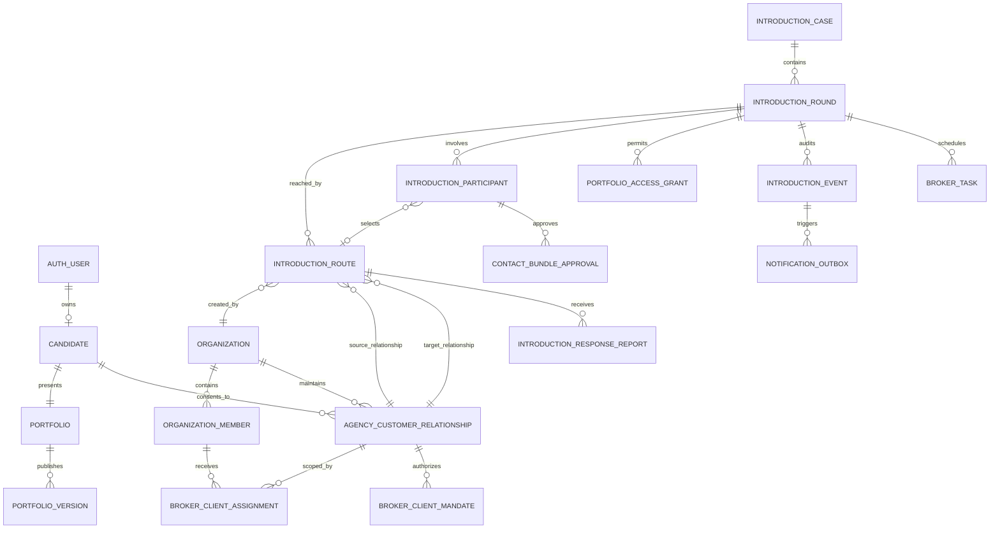

# BrokerDesk Phase 0D — Database and Authorization Architecture

> **Historical target architecture:** Cross-tenant, opaque-reference,
> customer-ownership, and command/projection principles remain useful. The
> proposed global pair/round/route schema, 30-day route expiry, Tasks, and
> combined customer route projection were not adopted by NAK-78. Current source
> and [`docs/vivintrodesk-mvp-contract.md`](../../docs/vivintrodesk-mvp-contract.md)
> are authoritative.

Status: Approved baseline; no production migration is authorized  
Depends on: Phase 0C Introduction State Contract  
Purpose: Define durable data ownership, cross-agency isolation, concurrency rules, disclosure controls, and an incremental path from the current Nakshatra schema.

## 1. Architectural decision

BrokerDesk will extend the existing Nakshatra identity and portfolio domains. It will not create broker-owned customer copies or a second profile system.

The database model separates four concepts that must never be collapsed:

1. **Person and portfolio** — one customer-controlled identity and one live published portfolio.
2. **Agency relationship** — a private relationship between one agency and one customer.
3. **Introduction case and round** — Nakshatra's customer-visible, pair-level workflow.
4. **Broker route** — one agency's private route into that workflow.

Multiple agencies may independently create routes for the same two customers. Nakshatra may correlate those routes internally, while every agency receives only its own route projection. Customers receive the combined pair-level projection.

Identifiers, URLs, and obscurity are not authorization. Every read and command must prove the actor, live session, tenant, capability, scope, resource relationship, and current workflow state.

## 2. Trust boundaries

| Boundary | May know | Must never learn |
|---|---|---|
| Customer | Their portfolio, counterpart's permitted view, all broker routes addressed to them, their decisions and disclosures | Agency-private notes, internal fraud signals, another customer's private fields before approval |
| Agency member | Assigned customers, the agency's routes, permitted portfolio projection, agency tasks and notes | Competing agency existence, count, identity, send time, route state, response, customer selection, or notes |
| Background worker | Only fields required for an authorized job | Broad interactive access or reusable customer exports |
| Support operator | Explicit support projection for a time-bound case | Default portfolio/document access, secrets, or unlogged impersonation |
| Browser/client | Opaque public references and authorized projections | Internal primary keys, encryption keys, service credentials, cross-tenant datasets |

The response shape, error, status code, timing, counters, notifications, and task creation must not become side channels that reveal competing broker activity.

## 3. Existing domains to reuse

The following remain source-of-truth domains:

| Existing capability | Reuse decision |
|---|---|
| Supabase authentication and `user_profiles` | Reuse; a broker is another authenticated actor, not another identity system |
| `organizations`, `organization_members`, `matchmaker_profiles` | Reuse as agency and membership roots; strengthen authorization with capability and assignment scope |
| `candidates` and structured candidate-detail tables | Reuse as the canonical person/candidate model |
| `portfolios`, versions, sections, media, visibility | Reuse; one customer-owned live portfolio |
| Public and approved sanitized snapshots | Reuse as projection patterns, not as universal broker permissions |
| Access/reveal lifecycle, audit events, secure storage | Generalize rather than recreate |
| Live-session checks, fixed-search-path RPCs, rate-limit function | Reuse as mandatory command perimeter |
| Didit candidate verification | Reuse for people; add a distinct business-verification domain for agencies |

Existing B2C `interest_requests` remain the public-viewer interest handshake. They must not be stretched into the BrokerDesk Introduction state machine.

## 4. Existing schema corrections required

### 4.1 Candidate ownership

`candidates.primary_owner_user_id` or an explicit customer delegate establishes customer ownership. Neither `created_by` nor `current_organization_id` may grant portfolio ownership.

The existing `owns_candidate` and `can_manage_portfolio` rules are too broad for a customer-owned, multi-agency model because some organization roles and creators can currently be treated as owners. Before BrokerDesk is enabled:

- split **customer ownership** from **agency relationship access**;
- remove organization membership and record creation as implicit ownership;
- require an explicit, revocable delegation for any agency-assisted portfolio edit;
- audit every delegated edit and show it to the customer.

`current_organization_id` may remain temporarily for backward compatibility, but it is not an authorization source and should eventually be deprecated.

### 4.2 Broker-client relationship

Evolve `broker_clients` into the canonical `agency_customer_relationship` concept. A physical rename is optional during migration; its meaning is not.

Minimum additions:

- opaque `public_id` for agency workspace URLs;
- lifecycle: invited, intake pending, claim pending, active, paused, expired, terminated;
- customer claim and consent timestamps;
- relationship start/end and renewal dates;
- source and import lineage;
- privacy/communication preferences;
- row version for optimistic concurrency.

Retain one relationship per `(organization_id, candidate_id)`. Never auto-merge relationships across agencies or expose whether the person already exists elsewhere.

Move free-form `notes` to a separate encrypted agency-private notes table with author, purpose, retention class, and immutable audit metadata.

### 4.3 Organization RBAC

The existing role presets are useful labels but are insufficient authorization. Effective access is:

`active membership × capability × resource scope × current mandate × live session`

Example capabilities:

- `customers.read`, `customers.invite`, `customers.edit_relationship`;
- `portfolio.review`, `portfolio.edit_as_delegate`;
- `introductions.create`, `introductions.send`, `introductions.record_response`, `introductions.close`;
- `tasks.manage`, `renewals.manage`;
- `team.invite`, `team.assign`, `settings.manage`, `verification.manage`.

Scope is one of: organization-wide, assigned customers, assigned team, or explicit resource. MVP roles map to capabilities, but database authorization checks capabilities and scope rather than trusting a role name.

### 4.4 Disclosure grants

The existing `reveal_grants` logic is tied to an `interest_request`. Generalize it into a single logical `portfolio_access_grants` domain supporting:

- B2C interest request source;
- BrokerDesk Introduction round source;
- named viewer identity;
- permitted access level and field/media bundle;
- purpose, issued/revoked/expired timestamps;
- grant issuer and evidence;
- immutable access audit.

Exactly one source must be present. Preserve existing validated lifecycle functions and compatibility views/RPCs during migration. Do not build a parallel BrokerDesk reveal table.

### 4.5 Attribution

Existing winner/conflict attribution does not match hidden, simultaneous broker routes. BrokerDesk stores immutable source attribution per route. It must not calculate or expose a winning agency in MVP.

## 5. Logical entity model

The names below describe the intended model. Final physical names may retain compatible existing names after migration review.

## 6. Introduction workflow tables

These tables belong in a private workflow schema such as `app_private`. `anon` and `authenticated` receive no direct table privileges. Public security-definer functions return purpose-built projections.

### 6.1 `introduction_cases`

One durable internal case for an unordered canonical customer pair.

Important fields:

- internal UUID primary key;
- customer-facing opaque `public_id`;
- ordered `candidate_low_id`, `candidate_high_id`;
- lifecycle status and timestamps;
- row version.

Invariant: `candidate_low_id < candidate_high_id`, and the pair is unique. Ordering is calculated server-side; clients never choose it.

A case may contain several rounds over time. This preserves history without allowing an expired or rejected round to be silently reopened.

### 6.2 `introduction_rounds`

One decision period for the pair.

Important fields:

- case, sequential round number;
- state from the Phase 0C contract;
- opened/closed timestamps and closure reason;
- rejection cooling end, if applicable;
- alignment state;
- row version.

Only one nonterminal round may exist per case. Rejection, permanent block, privacy pause, and unresolved split representation are enforced at this level.

### 6.3 `introduction_routes`

One agency's private act of introducing the pair.

Important fields:

- broker-facing opaque `public_id`, different from case public ID;
- round and organization;
- source and target candidate;
- source and target agency-customer relationship;
- creating/assigned member;
- state, sent time, expiry time, closure reason;
- send-time portfolio version references for audit only;
- idempotency key and row version.

Both relationship rows must belong to the same organization and to the two candidates in the case. A route belongs to exactly one agency. A broker projection never returns the case ID, customer case public ID, or another route.

Default policy permits at most one nonterminal route per organization, pair, and round. A retry produces an audited transition or a new attempt under that same private route according to the Phase 0C command contract; it must not create visible duplicates.

### 6.4 `introduction_participants`

Exactly two rows per round, one for each customer. This is the controlling person-level state.

Important fields:

- candidate and round;
- decision: pending, interested, rejected, blocked;
- selected route, when interested;
- decision source, actor, confirmed time;
- decision version and row version.

The selected route must be an eligible route in the same round involving that customer. A broker report alone does not populate the controlling decision unless an explicit, legally reviewed delegate policy permits it.

### 6.5 `introduction_response_reports`

Captures a broker's conventional phone, WhatsApp, or in-person report without granting cross-agency control.

Important fields:

- route, reporting member, subject candidate;
- reported outcome and channel;
- encrypted note reference;
- reported/confirmed/corrected/superseded timestamps;
- provenance and evidence metadata without raw message content by default.

Reports are route-scoped. Customer confirmation promotes an eligible report to a person-level command through a separate transaction.

### 6.6 `contact_bundle_approvals`

Stores each customer's explicit approval of named disclosure items, for example personal phone, personal email, parent/guardian name, and family contact.

Approval is specific to the round, viewer, bundle version, and purpose. Revocation affects future access immediately and is never inferred from an Interest action.

### 6.7 `introduction_events`

Append-only domain audit stream. It records state transitions, actor class, organization context where applicable, correlation ID, command ID, timestamp, audience classification, and tightly controlled metadata.

Do not store contact data, document content, free-form broker notes, secrets, or complete portfolio snapshots in event metadata.

### 6.8 `command_idempotency`

Stores actor/scope, command name, client idempotency key, canonical request hash, result reference, and expiry. Reusing a key with a different request is rejected. This protects double-clicks, retries, worker redelivery, and network timeouts.

### 6.9 `notification_outbox`

Written in the same transaction as the domain event. A worker later sends email/in-app notifications and records attempts. No workflow state depends on email delivery. Payloads contain references and template-safe variables, not full private portfolios.

## 7. Supporting BrokerDesk domains

### Agency onboarding and verification

- `organization_business_profiles`: legal/trading identity and operating details.
- `organization_verification_checks`: check type, provider, status, reviewer, evidence reference, expiry.
- `organization_verification_documents`: private storage object reference, document class, country, checksum, retention state.

Verification is layered: representative identity, business existence, business control/authority, contact/domain verification, and optional professional/reference checks. UI badges must state exactly what was verified and never imply background guarantees that were not performed.

### Customer assignment and mandates

- `broker_client_assignments`: relationship, member/team, scope, start/end.
- `broker_client_mandates`: consent purpose, permitted actions, evidence, start/end, revocation.

An assignment controls employee access. A mandate controls what the agency may do for the customer. Both are required for sensitive commands.

### Day-one import and claim

- `broker_import_batches`: agency, uploader, source, totals, state, checksum.
- `broker_import_rows`: encrypted staged data, validation state, error codes, claimed relationship reference.
- `broker_client_intakes`: private agency intake before the customer claims or completes a canonical profile.

Staged records are not globally searchable customer profiles. The platform must not disclose that a phone or email already exists. Claiming uses a one-time, hashed, expiring invitation and authenticated proof. Only after claim and consent is the agency relationship linked to the canonical candidate. No unclaimed intake may be shared in an Introduction.

### Operational work

- `broker_tasks`: actionable, assignable work linked to a relationship or route.
- `broker_interactions`: agency-private contact log with structured outcome and encrypted note.
- `broker_client_contracts`: relationship term and renewal state; financial details isolated and encrypted.

These support the dashboard but do not turn the product into a generic CRM.

## 8. Identifier and URL boundary

Use three identifier classes:

| Identifier | Where used | Rule |
|---|---|---|
| Internal UUID | Private tables, joins, logs with controlled access | Never accepted as sufficient authorization; avoid returning to browsers |
| Customer case public ID | Customer Introduction routes | Resolvable only through customer participant authorization |
| Broker route public ID | Agency Introduction routes | Resolvable only through matching organization, membership, capability, scope, mandate, and assignment |

Public IDs must be random and nonsequential. Customer and broker IDs for the same workflow must not be derivable from one another.

Email/invitation capability links use high-entropy random tokens. Store only a keyed hash, with purpose, subject, audience, single/multiple-use policy, issued time, expiry, revocation, and consumption state. A capability token grants only the narrow bootstrap action; sensitive profile access still requires the intended authenticated identity and fresh/live session.

Changing a URL ID, organization ID, candidate ID, or request body relationship ID must always fail closed. Responses should not reveal whether the inaccessible resource exists.

## 9. Database invariants

The database, not only application code, enforces:

1. A case contains two distinct ordered candidates and is unique per unordered pair.
2. A case has at most one nonterminal round.
3. A round has exactly two distinct participant candidates matching the case.
4. A route's organization owns both referenced agency-customer relationships.
5. A route's candidates and relationships exactly match the case pair.
6. At most one nonterminal route exists for the same organization/pair/round.
7. A selected route belongs to the same round, involves that participant, is eligible, and has not expired/rejected/blocked.
8. A route expires independently, normally 30 days after send. Expiry is `no_response`, never rejection.
9. Explicit rejection closes the round and establishes the 90-day cooling boundary.
10. Permanent block prevents new rounds/routes for that pair until the blocker explicitly reverses it, if reversal is allowed by policy.
11. Contact grants cannot be issued unless both participants have confirmed interest and selected eligible representation, alignment is resolved, and both required bundle approvals exist.
12. Revocation, rejection, blocking, critical privacy change, or relationship mandate loss revokes affected grants atomically.
13. Domain/audit events cannot be updated or deleted through application roles.
14. An idempotency key is unique within actor, scope, and command.
15. All timestamps are server-generated UTC; client timestamps are evidence only.

Where a multi-table rule cannot be expressed safely as a simple check constraint, enforce it inside the only permitted command function while holding locks, with a constraint trigger as defense in depth where practical.

## 10. Transaction contracts

### Send Introduction

One transaction:

1. Require a current authenticated session.
2. Resolve the actor's active organization membership, capability, assignments, and mandates.
3. Normalize the unordered pair server-side and acquire a pair-scoped transaction/advisory lock.
4. Validate both relationships, published portfolio eligibility, cooling/block/privacy state, and verification policy.
5. Find or create the private case and eligible round.
6. Create or return the agency's idempotent route without revealing existing competing routes.
7. Record send-time portfolio version references.
8. Append domain events, dashboard tasks, and notification outbox rows.
9. Return only the agency route projection.

The broker receives the same semantic success whether their route is first or later. No duplicate-warning, competitor count, changed copy, or timing-dependent detail is returned.

### Customer shows interest and selects broker

Lock the round and both relevant participant/route rows; validate the route is visible and eligible to the customer; write the selected route and confirmed person-level interest atomically; supersede earlier selection without exposing it to other agencies; append events and outbox rows. Use row versions to reject stale screens safely.

### Broker records a response

Lock only the agency route; validate reporter capability and assignment; append a route-scoped response report and customer confirmation task. Do not mutate the controlling participant decision or another route.

### Reject or permanently block

Lock the case/round and participants; record the person-level decision; close affected active routes with neutral broker-safe outcomes; revoke access grants; establish cooling or block; write events/tasks/outbox atomically.

### Release contacts

Lock both participants, their selected routes, alignment state, approvals, and existing grants. Re-evaluate every prerequisite at commit time. Create least-privilege identity-bound grants for approved bundles only. Never attach contacts directly to a notification payload.

### Publish portfolio update

Publish the canonical version and sanitized projections atomically. Normal updates become visible to active authorized views. Privacy reductions revoke or narrow grants immediately. Critical identity/status/ownership/verification changes place affected workflows into review/pause and create tasks through the outbox/event mechanism.

## 11. Authorization model

### Customer predicates

A customer may read a case projection only when their authenticated candidate is a participant in that case. Ownership and explicit delegation are separate predicates. A portfolio owner can edit their own canonical portfolio; an Introduction does not confer edit rights.

### Agency predicates

An agency member may read or act on a route only when all are true:

- live authenticated session;
- active membership in the route's organization;
- required capability;
- active resource assignment or organization-wide scope;
- active customer mandate for the command;
- route belongs to that organization;
- current route/round state allows the command.

Every agency read begins from the organization and assignment scope, never from a globally supplied candidate or case identifier.

### Worker predicates

Scheduled expiry, reminders, email, malware scanning, and projection refresh run under separate narrowly scoped service identities. Service-role credentials never reach a browser or general API handler. Workers accept immutable job IDs and re-authorize current state before acting.

### Support access

Support is deny-by-default. Future break-glass access requires a ticket/reason, approved capability, short expiry, fresh authentication, complete audit, and customer-visible disclosure where policy permits. Support must not impersonate silently.

### RPC perimeter

Mutation functions must:

- use `SECURITY DEFINER` only where necessary;
- set a fixed safe `search_path`;
- revoke default execution from `public`;
- require current/live session and explicit actor context;
- derive tenant/customer identity from trusted relationships rather than client claims;
- validate allowed transitions and row versions;
- use parameterized typed inputs and bounded lengths;
- emit audit/outbox records in the same transaction;
- return minimal typed projections.

RLS remains defense in depth. Private workflow tables receive no direct Data API grants.

## 12. Read projections

Never expose base rows as general-purpose JSON. Create separate projections/functions:

- **Customer inbox summary:** one card per counterpart/round with all eligible routes visible to that customer.
- **Customer Introduction detail:** permitted counterpart profile, route choices, person-level state, disclosure actions, customer-safe timeline.
- **Broker queue:** only the agency's routes, next action, expiry, assigned staff, and customer-visible decision needed for work.
- **Broker route detail:** agency's relationship context, permitted portfolio view, own reports/tasks/timeline only.
- **Worker projection:** job-specific minimum fields.
- **Support projection:** redacted metadata unless break-glass is active.

Broker-safe neutral outcomes must be vocabulary-controlled. Avoid totals or labels such as “another broker selected,” “duplicate,” or “competing route.”

## 13. Data classification and encryption

| Class | Examples | Protection |
|---|---|---|
| C0 Published/sanitized | Approved introduction summary fields | RLS/projection, cache controls, audit as appropriate |
| C1 Internal standard | Route state, task dates, non-sensitive preferences | Private tables, RLS/RPC, tenant scope, backups encrypted |
| C2 Sensitive personal | Contact details, family/private horoscope fields, broker notes | Field-level envelope encryption where retrieved narrowly; identity-bound grants; strict audit |
| C3 Restricted verification/business | Government/business documents, financial/contract data, verification evidence | Separate private storage/table, envelope encryption, short signed access, enhanced audit/retention |
| C4 Secrets/tokens | Invitation/access tokens, provider secrets, key material | Store token hashes only; secrets manager/KMS; never log; rotation and revocation |

Queryable matching attributes such as age/date-derived range, height, city, education, and stated preferences may need typed database columns. They remain private and RLS-protected rather than encrypted with nondeterministic ciphertext that makes matching impossible. Expose them only through bounded server-side matching queries.

For exact lookup of sensitive normalized values, use a keyed blind HMAC index separate from ciphertext. Never use unsalted plain hashes for phone/email correlation. Do not auto-link customers across agencies solely from these indexes.

Keys live outside the database in a managed KMS/secrets boundary. Use envelope encryption with key version, authenticated context binding, rotation plan, and separation between production/staging. Logs, analytics, traces, error trackers, queues, and outbox payloads must be scrubbed of C2-C4 data.

All uploads use private buckets, randomized object keys, type/size verification, malware scanning, image re-encoding/EXIF removal, checksums, short-lived signed access, and retention/deletion jobs.

## 14. Matching-query safety

Broker matching is a deterministic candidate suggestion service, not access to the customer table.

- Input is an authorized agency-customer relationship, not an arbitrary candidate ID.
- Search scope is only the agency's active, consented customer relationships.
- Mandatory mutual filters are evaluated server-side using typed fields.
- Results return a limited permitted summary and explainable filter reasons.
- Pagination, result caps, export prevention, query rate limits, and audit reduce harvesting risk.
- Horoscope documents and other private source files are not loaded just to compute a suggestion unless explicit consent and a reviewed computation path exist.
- No compatibility or desirability score is introduced in MVP.

## 15. Concurrency and isolation cases

### Broker A and Broker B send the same pair concurrently

Pair-scoped locking creates one case/round and two private routes. Each transaction returns only its own normal success response. Unique constraints prevent duplicate routes inside one agency without preventing legitimate routes across agencies.

### Both customers act at the same time

Round/participant row locks and row versions serialize decisions. Mutual interest may advance only after both committed decisions and alignment prerequisites are re-read in the same transaction.

### Rejection races with interest/contact release

Rejection/block/privacy revocation has safety priority. Contact release re-checks terminal and grant conditions under locks immediately before commit. If state changed, release fails with a customer-safe generic result.

### Expiry races with a response

The command compares trusted database time while holding the route lock. A response committed before expiry wins; an expiry committed first requires an explicit retry path. Expiry is never rewritten as rejection.

### Portfolio changes during viewing

Normal publishes replace the authorized current projection. Critical changes pause or revoke access atomically. Send-time version references remain for audit, not continued customer viewing.

## 16. Retention, deletion, and audit

Before implementation, define retention by data class and legal/business purpose. Minimum principles:

- user-facing closure is not deletion;
- agency access ends when relationship or mandate ends;
- operational notes/contracts follow an explicit retention schedule;
- staged unclaimed imports expire quickly;
- capability tokens and signed links expire and are revocable;
- immutable security/domain audit is pseudonymized where possible and retained for a defined period;
- account deletion removes or cryptographically erases customer content subject to documented legal holds;
- backups are encrypted and expire on a known schedule;
- analytics use pseudonymous IDs and never reconstruct cross-agency graphs.

## 17. Migration sequence

No migrations are created in Phase 0D. When implementation is approved, use this order:

1. Add private types, helper predicates, data classifications, and security tests.
2. Separate candidate ownership/delegation from agency relationship access.
3. Enhance agency-customer relationships; extract encrypted notes; add assignments, capabilities, scopes, and mandates.
4. Add verified intake/import/claim tables for the 100-customer onboarding flow.
5. Add Introduction case, round, route, participant, report, approval, event, idempotency, task, and outbox tables.
6. Generalize reveal grants into the shared portfolio access-grant domain with B2C compatibility.
7. Add command RPCs and separate customer/broker/worker/support projections.
8. Add constraints, triggers, RLS, grants, encryption integration, and worker identities.
9. Backfill only verified compatible data; do not infer cross-agency links from broker spreadsheets.
10. Run isolation, concurrency, privacy, restore, and rollback tests before enabling a feature flag.

The public B2C flow stays operational throughout. An existing `interest_request` may become an Introduction source only through a later explicit, idempotent bridge command—not through an automatic schema reinterpretation.

## 18. Required security tests

The implementation is not releasable until automated tests prove:

- changing every customer, organization, relationship, route, case, round, task, document, or grant identifier cannot cross authorization boundaries;
- Broker A cannot infer Broker B via reads, writes, errors, counts, exports, search, notifications, task changes, response time, or realtime events;
- an employee loses access immediately when membership, assignment, capability, or mandate is revoked;
- broker reports cannot change another route or person-level decision;
- customer route selection cannot select an invisible, expired, blocked, or unrelated route;
- parallel sends create the correct hidden case and isolated routes;
- rejection/block/privacy changes defeat concurrent disclosure attempts;
- idempotent retries do not duplicate routes, emails, tasks, decisions, grants, or charges;
- signed/capability tokens are hashed, scoped, expiring, revocable, and audience-bound;
- field/media disclosure matches the exact approved bundle;
- logs, audit metadata, outbox, analytics, and errors contain no prohibited sensitive values;
- private tables and storage are inaccessible directly to anonymous/authenticated browser roles;
- backup restore preserves constraints, encryption metadata, and tenant isolation.

## 19. Phase 0D decisions requiring confirmation

Recommended defaults are included in this contract, but the following must be confirmed before migration design:

1. **Relationship requirement:** both people must be active customers of the sending agency before that agency may send. This matches the current scenario and is the safest MVP default.
2. **Delegated editing:** agency-assisted portfolio edits require a separate customer-granted mandate and remain drafts until customer approval. Recommended for MVP; agencies should not publish directly.
3. **Permanent block reversal:** customer may reverse “Never show again” only after fresh authentication and a warning, or it is irreversible through self-service. Product/legal decision required.
4. **Support access:** decide whether customers are notified after approved break-glass profile access.
5. **Retention periods:** legal review is required for verification documents, broker notes, contracts, audit, expired Introductions, and imported unclaimed records.
6. **Business verification jurisdiction:** required documents and authoritative registries vary by country/state and must be configured rather than hardcoded.

The deferred split-representation and B2C-plus-broker acceptance scenarios remain fail-closed states. The schema preserves the evidence needed to resolve them later without revealing agencies to one another.

## 20. Phase 0D acceptance criteria

Phase 0D is ready for approval when:

- the entity boundaries and source-of-truth reuse map are accepted;
- candidate ownership no longer depends on creating/current organization in the proposed model;
- customer and broker identifiers/projections are explicitly separate;
- multi-broker routes are permitted while cross-agency visibility is structurally prevented;
- all state-changing operations have atomic command contracts;
- contact disclosure prerequisites are enforceable at the database boundary;
- encryption, storage, audit, retention, worker, and token boundaries are documented;
- day-one import does not create unconsented globally shareable profiles;
- migration sequence preserves B2C compatibility;
- unresolved product/legal choices are explicit and fail closed.
